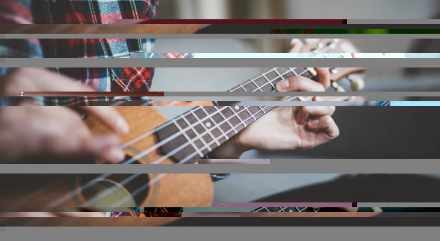

# The databending tutorial!

I decided to make a sort of tutorial for databending, since there can be a bit of trial and error during the beginning.
This should help with producing some better databent things, and avoid just breaking the file and making it unusable.

## Part 1 - The TL;DR explanation

Have you seen *Avatar - The Last Airbender*? If you have, then you know there are many *benders* in that show, most famously *fire, water, air,* and *earth*. To put it simply, they control certain elements and do as they please with them. Using that analogy, *databending* works the same way; **it's the act of manipulating raw data.**

A better word for it is *corrupting* or *glitching*, since everything you databend will end up breaking in some way. This makes sense - If you screw with the instructions that make something, you will eventually end up breaking it. Here's an example of a databend:

|                     normal                     |               databent                |
| :--------------------------------------------: | :-----------------------------------: |
|  |  |

## Part 2 - How do I start?

Well - a very easy way to start is to use `glitchup`, the tool you're looking at right now! Some alternate methods are shown in the [**Q&A**](./Q&A.md), if you'd prefer to use those instead, however I'm willing to say *(with a hell of a lot of bias)* that `glitchup` is currently the best way to databend something.

Databending has the following steps:

- Prepare the thing you're about to glitch.
- Mess around with its contents.
- Witness your creation.

Very, **very** simple process, that can also be slightly deceiving. For example, the *preparation* process is the most important part. Why? Because different files act differently *(funny that)*.

## Part 3 - Some examples!

Let's talk about compression! Compression is a process to pack in as much information in as little bytes as possible. There are many strategies to doing this, but at the end of the day you don't need to know how a file was compressed, only that *different compressions produce different results*. The following are examples of different image compressions:

|          |        original         |                jpg                 |               bmp               |                  tiff                  |              png              |
| -------: | :---------------------: | :--------------------------------: | :-----------------------------: | :------------------------------------: | :---------------------------: |
|    image |  |    |  |         |  |
| metadata |                         | *Baseline (standard)*, quality = 7 |        *windows* 24-bit         | *no compression*, **rrggbb**, *ibm-pc* |     *smallest file size*      |
|  options |                         |        it=29, ch=4539bytes         |       it=4, ch=3630bytes        |           it=8, ch=2582bytes           |          it=1 ch=617          |
| filesize |          266Kb          |               59.9Kb               |              856Kb              |                 331Kb                  |             266Kb             |

In the above, the mutation was **shift** - `it` stands for *iterations*, and `ch` stands for *chunksize*. Also I converted the images by screwing around in Photoshop settings.

You may notice that the results are **far from similar**. I generated 100 images with different options, and picked ones that were as stable as possible, while also being as corrupted as possible. The following shows the ratio of *modified bytes* to *filesize*:

| format | ratio |
| -----: | :---- |
|    jpg | 220%  |
|    bmp | 2%    |
|   tiff | 6%    |
|    png | 0.2%  |

You can take this to be a metric of **volatility**, or the amount of effect that databending has on a format. Note that this is all improvised by me, so no need to take it too seriously - but there are some very interesting results here.

Firstly, **jpg** seems to be the worst contender. That ratio is ridiculously large, meaning that a significant amount of databending is required to produce any sort of effects. If you look at the result, you might also see that it's the least corrupt out of all of them as well. Something to add to this is that *jpeg breaks easily* - meaning that a large amount of time, the resulting image will be broken and won't load anyways. All in all, *jpegs aren't that nice to databend*. Although having said that, sometimes they do make some interesting artefacts.

Then comes **bmp**.  Things have indeed shifted around, and the ratio *2%* means that effects present themselves quite easily. The image also looks interesting! However, the image size ended up being pretty large, which is something to take not of. At least you can change the bit settings around and see different interesting results using that.

After that is **tiff**. This one is my favourite, the RGB effects are always pretty nice, and the ratio of *6%* isn't really bad at all. File size seems to be half of *BMP* which is good. Nuff said.

Last one's **png**. This one is *insanely volatile*. Even with a ratio of *0.2%*, the image ended up breaking. Seeing it locally it's databent, but on this page it looks like the image never ended up loading! Note that artefacts with pngs *are quite interesting*, but be sure to be quite *cautious* with your options.

I could go on, testing some more image formats, and maybe even audio and video formats - but that would go on to be ***pretty long!***. If you do want to see more however, open an issue!

Here's the `Options.toml` used to make the results:

```toml
inputfile = "images/ukelele.jpg"
outputfile = "images/corrupted/jpeg-corrupted.jpg"

times = 100

iterations = 1000
chunksize = 1000

mutations = [
    ["Shift"]
]

[ShiftConfig]
iterations = [1,100]
chunksize = [50,5000]
```

This was as simple as having `Options.toml` in the same directory as the `glitchup` executable, and then just running `glitchup`. It should be pretty easy to use (hopefully)! If it isn't, open an issue and I'll update this file with more instructions!